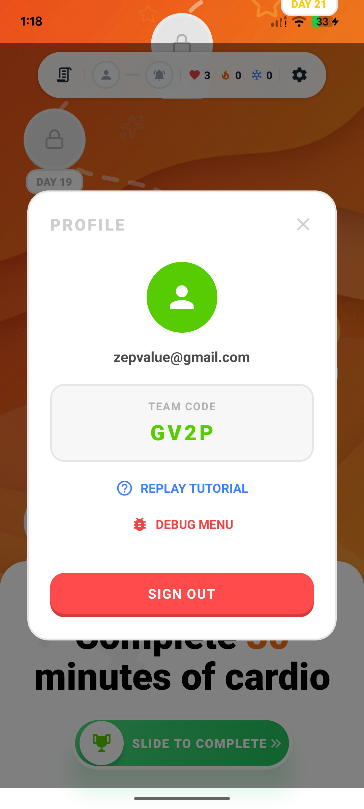
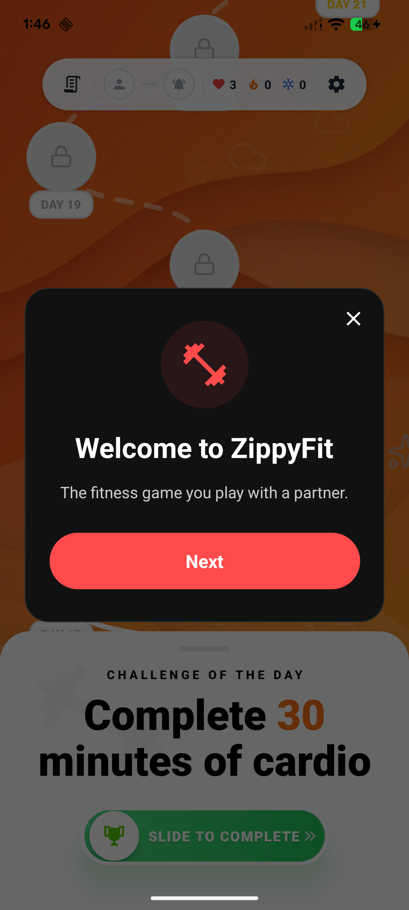

<div align="center">

# 🏋️ ZippyFit

### The fitness game you play with a partner.

*Work out together, keep your streak alive, and slay the boss — miss a day and you __both__ feel it.*

<br/>


</div>

---

## ✨ What is ZippyFit?

ZippyFit turns accountability into a co-op game. You and a partner form a **Duo**, take on a **daily challenge**, and every workout you log deals damage to a shared **boss**. Stay consistent to grow your **streak** — slack off and your team loses **hearts**. It's Duolingo's streak psychology, pointed at the gym.

<div align="center">

&nbsp;&nbsp;

&nbsp;&nbsp;

<br/><br/>

&nbsp;&nbsp;

</div>

---

## 🎮 Features

- 👯 **Duo teams** — pair up with a 4-character invite code
- 🔥 **Streaks & hearts** — shared accountability; if one partner misses, you both lose a heart
- 🐉 **Boss battles** — every logged workout chips away at the team boss's HP
- 🗺️ **Journey map** — a visual day-by-day path of your team's progress
- 📜 **Grimoire** — unlock a "Scroll Fragment" of fitness wisdom on every workout
- 👋 **Nudge & Spot** — poke your partner or request a spot when you can't make it
- 🔐 **Auth built in** — email/password via Convex Auth, with real-time sync

---

## 🧱 Tech Stack

| Layer | Tech |
|-------|------|
| **Mobile** | React Native · Expo Router · Reanimated · Moti |
| **Realtime DB** | Convex (live queries + auth) |
| **Backend API** | FastAPI · Uvicorn (Python) |
| **Local tunnel** | ngrok → port 8000 |

---

## 🚀 Getting Started

```bash
# 1. Install dependencies (mobile + backend)
make install

# 2. Run the full stack (ngrok + backend + Convex + Expo)
make dev
```

Then scan the QR code with **Expo Go**, or press `a` / `i` to launch an emulator.

### Handy commands

Run **`make`** (or `make help`) any time to see the full categorized menu — commands are grouped into Development / Setup / Quality / Utilities / Maintenance.

| Command | What it does |
|---------|--------------|
| `make help` | Show the categorized command menu |
| `make dev` | Full stack — tunnel, backend, mobile |
| `make backend` | Backend only (Convex + uvicorn) |
| `make mobile` | Expo only |
| `make test` | Run mobile tests |
| `make screenshot` | Capture a screenshot from a connected Android device |
| `make reset-password EMAIL=… PASSWORD=…` | Admin password reset |
| `make kill` | Kill all dev processes & free ports |

---

## 📁 Project Structure

```
zippy-fit/
├── mobile/              # React Native / Expo app
│   ├── app/             # Expo Router routes (index, _layout)
│   ├── screens/         # Dashboard, Auth, Tutorial
│   ├── components/      # UI: ProfileModal, DuoButton, Container…
│   └── convex/          # Schema + serverless functions (teams, workouts, dashboard, admin…)
├── backend/             # FastAPI service
├── scripts/utils/       # Dev tooling — screenshot, reset_password, check_user, assign_team
├── docs/screenshots/    # Images used in this README
└── Makefile             # Categorized command centre (run `make help`)
```

---

## 🗺️ Roadmap

- [ ] **Push notifications** — nudges & streak-at-risk reminders
- [ ] **Forgot-password flow** — in-app reset (Convex Auth email provider)
- [ ] **Real boss roster** — multiple bosses with art & scaling HP
- [ ] **Grimoire content** — replace placeholder facts with a curated library
- [ ] **Refresher polish** — show only educational slides when replaying from settings
- [ ] **Workout types** — log cardio / strength / mobility with distinct damage
- [ ] **Partner profiles & avatars**
- [ ] **Test coverage** — expand TDD suite across screens and Convex functions
- [ ] **CI** — lint + typecheck + tests on every PR

---

<div align="center">

Built with ❤️ and a refusal to skip leg day.

</div>
